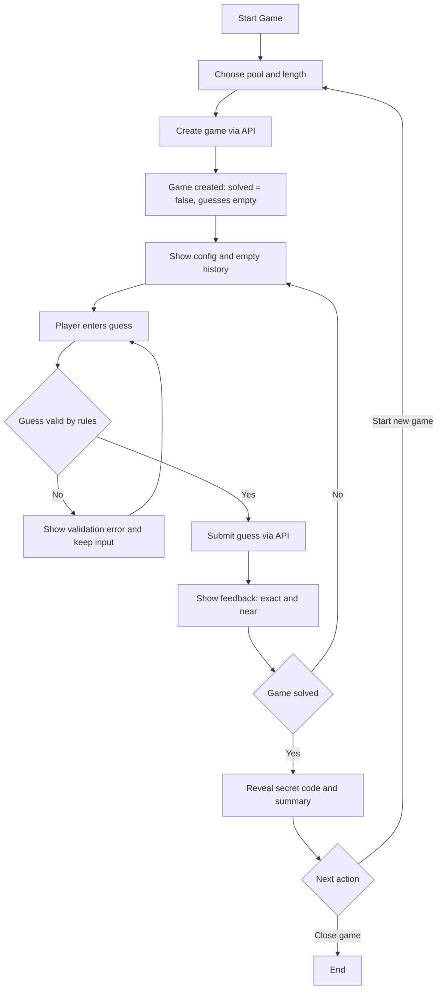
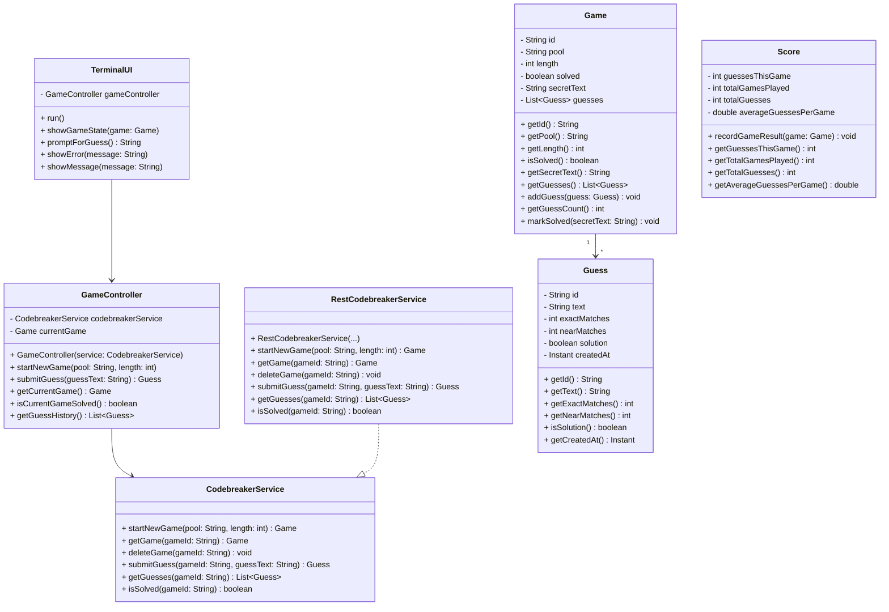

# Codebreaker Solitaire Client – Architecture and Design

## 0. Introduction

This document describes the architecture and design of a Java-based client for the Codebreaker Solitaire REST API. It brings together four phases:

- **Phase 1** – Requirements and user stories (what the client does).  
- **Phase 2** – Separation of concerns and technical specifications (where responsibilities live).  
- **Phase 3** – Class design (how the main classes are structured).  
- **Phase 4** – Future-proofing for GUI and mobile (how the design survives platform changes).

An **Architecture Overview** at the end summarizes the key layers and abstractions.

---

## Phase 1 – Requirements and User Stories (Draft)

### 1. Overview

Phase 1 focuses on **what** the Codebreaker Solitaire client does from the player’s point of view, independent of UI technology (console, JavaFX, Android). It captures the game lifecycle, how Unicode input is explained, and how the application reacts to common error scenarios.

---

### 2. Game lifecycle (user-facing behavior)

A single Codebreaker Solitaire game starts when the player creates a new game, proceeds through one or more guesses, and ends when the secret code is guessed or the game is abandoned/deleted.

#### 2.1 Game creation

- The player chooses:
  - A pool of characters to build the secret code from (any Unicode characters).
  - A code length between 1 and 20 characters.
- The application sends a request to create a new game and receives:
  - A unique game identifier.
  - The chosen pool and length.
  - A flag `solved = false`.
  - An empty list of guesses.
- The secret code itself is not shown at this point; the player only sees the configuration and that a new game has started.

#### 2.2 Guessing loop

- The player enters guesses, one at a time, for the secret code.
- Each guess must:
  - Use only characters from the current game’s pool.
  - Be exactly the configured length.
- For each valid guess, the application shows:
  - The guess text.
  - The number of exact matches (right character, right position).
  - The number of near matches (right character, wrong position).
  - Whether this guess is the solution.
- The game view updates to show a running history of all guesses and their feedback until the game ends.

#### 2.3 Game completion

- When a guess exactly matches the secret code:
  - That guess is marked as the solution.
  - The game is marked as solved.
  - The secret code is revealed in the game details.
- After completion:
  - The player can no longer submit new guesses for this game.
  - The player can review the list of guesses and their feedback.
  - The player is encouraged to start a new game if they want to continue playing.

#### 2.4 Retrieving and deleting games

- The player can resume an existing game (if it still exists) by:
  - Selecting it from a list of games, or
  - Following a previously saved link/identifier.
- The player can request to delete a game, which:
  - Removes the game and its guesses from the service.
  - Makes the game unavailable for future retrieval.
- Inactive games may also be removed by the service after a period of inactivity; the client must handle this gracefully.

---

### 3. Unicode flexibility (what the UI must explain)

The service allows any Unicode characters in the pool and guesses, with a few validation rules around validity of code points and length.

#### 3.1 Explanation to the player

The user interface must clearly explain:

- The player can choose **any visible characters** for the pool:
  - Letters, digits, symbols, emoji, or combinations thereof.
- The secret code and guesses are built from exactly those characters:
  - Every character in a guess must be taken from the pool.
  - Each guess must be exactly the configured length.

#### 3.2 Presentation of pool and length

- When configuring a new game:
  - Show a pool input and length input with short, clear labels (e.g., “Character pool” and “Code length”).
  - Give a brief hint such as:
    - “You can use letters, numbers, symbols, or emoji. All guesses must be N characters long and use only characters from this pool.”
- When playing:
  - Continuously display the pool and the required length near the guess input.
  - Render the pool exactly as entered, preserving Unicode characters and order.

#### 3.3 Optional presets and custom pools

- The client may offer presets (e.g., A – F, digits, emoji sets) but must also allow fully custom pools.
- If the service ignores duplicate characters in the pool, the UI may explain this briefly (e.g., “Duplicate characters in the pool have no effect”).

---

### 4. Error scenarios and user-facing reactions

This section describes how the application should behave for five common error scenarios. The focus is on clear, actionable messages and preserving user input where possible.

#### 4.1 Invalid game setup (400 Bad Request on create-game)

**Examples**

- Code length is outside the allowed range (e.g., < 1 or > 20).
- Pool is missing, empty, or contains invalid code points.

**Application behavior**

- Do **not** start a game.
- Keep the user on the game-setup screen with entered values preserved.
- Show a clear message near the invalid fields, such as:
  - “Check your game settings: length must be between 1 and 20, and the pool must contain valid characters.”
- Highlight the field(s) that caused the error and, when possible, show specific hints derived from error details.

#### 4.2 Guess length mismatch (400 Bad Request on submit-guess)

**Example**

- The player submits a guess whose character count does not match the game’s length.

**Application behavior**

- Do **not** send guess history updates; treat the guess as invalid.
- Preserve the guess text in the input so the player can adjust it.
- Show a local validation message near the guess field:
  - “Your guess must be exactly N characters long. You entered M characters.”

#### 4.3 Invalid character in guess (client-side validation)

**Example**

- The player types a character that is not part of the chosen pool.

**Application behavior**

- Validate guesses on the client before sending them:
  - Each character must belong to the current pool.
- If the guess contains invalid characters:
  - Either prevent input (ignore the character or visually mark it as invalid), or
  - Allow input but display a prominent warning next to the guess:
    - “All characters must come from the pool: [pool].”
- Do **not** submit invalid guesses to the service.

#### 4.4 Game not found (404 Not Found)

**Examples**

- The player opens a link or tries to resume a game that:
  - Has been deleted by the user, or
  - Has been cleaned up after long inactivity.

**Application behavior**

- Show a friendly message:
  - “This game no longer exists. It may have expired or the link is invalid.”
- Provide a clear next step:
  - “Start a new game” action that returns the user to the new-game flow.
- If 404 occurs when looking up a specific guess, offer:
  - “That guess is no longer available. Try refreshing the game or start a new one.”

#### 4.5 Game already solved (409 Conflict on submit-guess)

**Example**

- The player attempts to submit another guess after the game has been solved.

**Application behavior**

- Do **not** accept the guess or modify game history.
- Show a message:
  - “This game is already completed; you cannot submit more guesses.”
- Display the final game state:
  - Revealed secret code.
  - List of all guesses and feedback.
- Offer clear actions:
  - “Start a new game.”
  - “Close/delete this game.”

#### 4.6 Generic network or server failure (non-2xx, transient errors)

**Examples**

- Service unavailable (5xx).
- Network connectivity issues.

**Application behavior**

- Show a friendly, generalized error message:
  - “Something went wrong talking to the Codebreaker service.”
- Optionally display a short technical summary (status code and short message) for advanced users.
- Preserve the user’s current input (game configuration or guess).
- Provide a “Retry” option, and, if appropriate, a way to return to a safe screen (e.g., game list or new-game setup).

---

### 5. Summary of user stories (Phase 1)

**Player story – puzzle focus**

> As a puzzle-loving player,  
> I want to configure a code using any characters I like and then iteratively guess it based on feedback,  
> so that I can challenge my deductive reasoning and try to solve the code in as few guesses as possible.

**Player story – Unicode creativity**

> As a creative player,  
> I want to build codes out of symbols and emoji instead of only letters and numbers,  
> so that I can make the game feel more personal and playful.

**Learner story – educational focus**

> As a developer learning about web services,  
> I want to see how each of my guesses changes the game state retrieved from a REST API,  
> so that I can better understand how client–server interactions power interactive applications.

**Player story – short-session play**

> As a busy player with only a few minutes at a time,  
> I want to be able to start a game, make a few guesses, and resume it later without losing progress,  
> so that I can enjoy the puzzle in short sessions throughout my day.

**Player story – difficulty progression**

> As a player who likes to improve over time,  
> I want to adjust the pool and length to make codes simpler or more complex,  
> so that I can ramp up the difficulty as I get better and track my performance across games.



---

## Phase 2 – Separation of Concerns and Technical Specifications (Draft)

### 1. Overview

Phase 2 focuses on **where** responsibilities live in the Codebreaker Solitaire client, independent of UI technology (console, JavaFX, Android). It covers layered design, HTTP/JSON library choices (with Android in mind), DTO usage, and a UI-agnostic `CodebreakerService` interface.

---

### 2. Layered architecture (where responsibilities go)

We divide responsibilities into four main layers.

#### 2.1 Layers and responsibilities

- **Domain layer**
    - Core concepts and rules: `Game`, `Guess`, `ErrorInfo`, optional `GameStats`.
    - No knowledge of HTTP, JSON, DTOs, or UI frameworks.

- **Application / service layer**
    - Coordinates use cases: start game, submit guess, refresh game state, delete game.
    - Depends only on domain types and the `CodebreakerService` interface.

- **Infrastructure layer**
    - Handles external details: HTTP clients, JSON mapping, API DTOs.
    - Implements `CodebreakerService` using specific HTTP + JSON libraries.
    - Contains DTO classes that match the Codebreaker API JSON.

- **UI layers** (console, JavaFX, Android)
    - Present domain data and collect user input.
    - Depend only on `CodebreakerService` and domain types; never perform HTTP calls or parse JSON.

#### 2.2 Conceptual packages

- `codebreaker.domain`
    - `Game`, `Guess`, `ErrorInfo`, `GameStats`

- `codebreaker.application`
    - `CodebreakerService` (UI- and HTTP-agnostic interface)

- `codebreaker.infrastructure.dto`
    - `GameDto`, `GuessDto`, `ErrorDto`

- `codebreaker.infrastructure.http`
    - HTTP client adapter(s) using OkHttp / Retrofit / `java.net.http.HttpClient`
    - Mapper between DTOs and domain

- `codebreaker.ui.console`, `codebreaker.ui.javafx`, `codebreaker.ui.android`
    - Controllers / view models and views per platform

---

### 3. Library strategy (HTTP and JSON)

#### 3.1 HTTP client choices

- **`java.net.http.HttpClient`**
    - Standard in Java 11+ and good for pure desktop use.
    - Not available in typical Android runtimes; not suitable as the shared HTTP foundation.

- **OkHttp**
    - Modern HTTP client for JVM and Android; widely adopted on Android.
    - Works on desktop and Android with the same API; ideal as the common low-level HTTP engine.

- **Retrofit 2**
    - High-level REST client built on OkHttp; annotation-based interfaces, automatic JSON mapping.
    - De facto standard for REST APIs in Android apps.

#### 3.2 HTTP strategy for this project

- **Desktop (console / JavaFX)**
    - Prefer an `OkHttp`-based implementation of `CodebreakerService`.
    - Optionally, a `java.net.http.HttpClient` implementation may exist but remains desktop-only.

- **Android**
    - Use `Retrofit 2 + OkHttp` in the infrastructure layer as the `CodebreakerService` implementation.

- **Common rule**
    - All HTTP choices are hidden behind `CodebreakerService`; domain and UI never depend on OkHttp, Retrofit, or `java.net.http.HttpClient`.

#### 3.3 JSON mapping with Moshi

- **Moshi**
    - Modern JSON library for Kotlin and Java; designed for Android and JVM.
    - Integrates directly with OkHttp and has official Retrofit support via a Moshi converter.

- **Strategy**
    - Use Moshi in `codebreaker.infrastructure` to serialize/deserialize DTOs:
        - Desktop: OkHttp + Moshi.
        - Android: Retrofit + Moshi + OkHttp.
    - Domain and application layers see only domain objects, not JSON or Moshi types.

---

### 4. JSON mapping and DTOs

#### 4.1 Domain models vs DTOs

- **Domain models** (`Game`, `Guess`, `ErrorInfo`)
    - Reflect game concepts (state, guesses, error info) independently of JSON layout.
    - Used by `CodebreakerService` and all UI layers.

- **DTOs** (`GameDto`, `GuessDto`, `ErrorDto`)
    - Mirror the Codebreaker API JSON structure and field names.
    - Annotated/configured for Moshi in the infrastructure layer.

#### 4.2 Mapping responsibilities

- Dedicated mapping functions in the infrastructure layer:
    - API → DTO → domain (for responses).
    - Domain → DTO → API (for requests, where needed).

- Only the infrastructure layer knows about JSON and Moshi; domain and UI remain insulated from API shape changes.

---

### 5. CodebreakerService interface (UI-agnostic service)

#### 5.1 Essential methods

- Game lifecycle
    - `Game startNewGame(String pool, int length)`
    - `Game getGame(String gameId)`
    - `void deleteGame(String gameId)`

- Guessing
    - `Guess submitGuess(String gameId, String guessText)`
    - `List<Guess> getGuesses(String gameId)`

- Convenience / status
    - `boolean isSolved(String gameId)`

#### 5.2 Design properties

- UI-agnostic:
    - No references to console, JavaFX, Android, or UI classes.

- Transport-agnostic:
    - No HTTP or JSON types; usable regardless of whether the implementation uses OkHttp, Retrofit, or `java.net.http.HttpClient`.

- Domain-oriented:
    - Returns domain `Game` and `Guess` objects that align with the API’s `Game` and `Guess` state (including `solved` and guess history).

---

## Phase 3 – Class Design (Draft)

### 1. Overview

Phase 3 focuses on the **structure** of the system: the main classes (nouns) and their responsibilities and operations (verbs). It covers domain modeling of core classes, Java-style class signatures (fields and method names only, no bodies), and a Mermaid.js class diagram showing relationships between `TerminalUI`, `GameController`, and `RestCodebreakerService`.

---

### 2. Domain modeling (nouns and verbs)

The domain model centers around three core classes:

- **Game**
    - Represents a Codebreaker Solitaire game, including configuration (pool, length), current state (solved or not), and guess history.
    - Holds the current game state and a list of associated `Guess` objects.

- **Guess**
    - Represents a single guess submitted by the player and the feedback returned by the API.
    - Holds one guess’s data (text) and feedback (exact/near matches, whether it solved the game).

- **Score**
    - Represents performance metrics for one or more games (e.g., guesses per game, total games, aggregates).
    - Aggregates results across games to support statistics and comparison.

---

### 3. Class signatures (Game, Guess, Score)

#### 3.1 Game

```text
public class Game {

    // Fields
    private String id;
    private String pool;
    private int length;
    private boolean solved;
    private String secretText;        // revealed when solved (may be null or absent while unsolved)
    private List<Guess> guesses;

    // Constructors
    public Game(String id, String pool, int length);

    // Accessors
    public String getId();
    public String getPool();
    public int getLength();
    public boolean isSolved();
    public String getSecretText();
    public List<Guess> getGuesses();

    // Domain helpers
    public void addGuess(Guess guess);
    public int getGuessCount();
    public void markSolved(String secretText);
}
```

#### 3.2 Guess

```text
public class Guess {

    // Fields
    private String id;
    private String text;
    private int exactMatches;
    private int nearMatches;
    private boolean solution;
    private Instant createdAt;

    // Constructors
    public Guess(String id, String text, int exactMatches, int nearMatches, boolean solution, Instant createdAt);

    // Accessors
    public String getId();
    public String getText();
    public int getExactMatches();
    public int getNearMatches();
    public boolean isSolution();
    public Instant getCreatedAt();
}
```

#### 3.3 Score

```text
public class Score {

    // Fields
    private int guessesThisGame;
    private int totalGamesPlayed;
    private int totalGuesses;
    private double averageGuessesPerGame;

    // Constructors
    public Score();

    // Recording results
    public void recordGameResult(Game game);

    // Accessors
    public int getGuessesThisGame();
    public int getTotalGamesPlayed();
    public int getTotalGuesses();
    public double getAverageGuessesPerGame();
}
```

All signatures above omit method bodies and focus on fields and method names that align with the lifecycle and state described in earlier phases.

---

### 4. Application and UI-facing classes

#### 4.1 GameController

`GameController` orchestrates a single game session from the client’s perspective. It depends on a `CodebreakerService` to perform API operations and exposes methods that UIs call to start a game, submit guesses, and query state.

```text
public class GameController {

    // Dependencies
    private CodebreakerService codebreakerService;

    // State
    private Game currentGame;

    // Constructors
    public GameController(CodebreakerService codebreakerService);

    // Game lifecycle
    public void startNewGame(String pool, int length);
    public Game getCurrentGame();
    public boolean isCurrentGameSolved();

    // Guessing
    public Guess submitGuess(String guessText);
    public List<Guess> getGuessHistory();
}
```

#### 4.2 RestCodebreakerService

`RestCodebreakerService` is a concrete implementation of `CodebreakerService` in the infrastructure layer. It uses HTTP and JSON internally via libraries chosen in Phase 2, but those details are not exposed in its signature.

```text
public interface CodebreakerService {

    // Game lifecycle
    Game startNewGame(String pool, int length);
    Game getGame(String gameId);
    void deleteGame(String gameId);

    // Guessing
    Guess submitGuess(String gameId, String guessText);
    List<Guess> getGuesses(String gameId);

    // Status
    boolean isSolved(String gameId);
}

public class RestCodebreakerService implements CodebreakerService {

    // Constructors
    public RestCodebreakerService(/* HTTP and JSON dependencies */);

    // Game lifecycle
    public Game startNewGame(String pool, int length);
    public Game getGame(String gameId);
    public void deleteGame(String gameId);

    // Guessing
    public Guess submitGuess(String gameId, String guessText);
    public List<Guess> getGuesses(String gameId);

    // Status
    public boolean isSolved(String gameId);
}
```

#### 4.3 TerminalUI

`TerminalUI` is a console-based UI component. It interacts with the user via standard input/output and delegates all game operations to `GameController`.

```text
public class TerminalUI {

    // Dependencies
    private GameController gameController;

    // Constructors
    public TerminalUI(GameController gameController);

    // Main loop
    public void run();

    // Helpers
    public void showGameState(Game game);
    public String promptForGuess();
    public void showError(String message);
    public void showMessage(String message);
}
```

---

### 5. Mermaid.js class diagram (bird’s-eye view)



---

## Phase 4 – Future-proofing for GUI and Mobile (Draft)

### 1. Overview

Phase 4 focuses on **tomorrow**: how this design survives a platform change from console to JavaFX and Android. It covers how we structure service methods for non-blocking UI environments, how our separation of concerns minimizes changes when replacing `TerminalUI` with other views, and which Android-specific networking and security requirements we should consider now so `RestCodebreakerService` can move to mobile with minimal redesign.

---

### 2. Threading and async (service method structure)

In a console app, it is acceptable to block the calling thread while waiting for HTTP responses. In JavaFX and Android, blocking the UI thread is not acceptable; network calls must be offloaded and results delivered asynchronously to the UI.

#### 2.1 Asynchronous service interface

To support both blocking console flows and non-blocking GUI/mobile UIs, the application-level service should expose asynchronous variants of its methods. A simple, standard-library-friendly option is `CompletableFuture`.

```text
public interface AsyncCodebreakerService {

    // Game lifecycle
    CompletableFuture<Game> startNewGameAsync(String pool, int length);
    CompletableFuture<Game> getGameAsync(String gameId);
    CompletableFuture<Void> deleteGameAsync(String gameId);

    // Guessing
    CompletableFuture<Guess> submitGuessAsync(String gameId, String guessText);
    CompletableFuture<List<Guess>> getGuessesAsync(String gameId);

    // Status
    CompletableFuture<Boolean> isSolvedAsync(String gameId);
}
```

Key points:

- **Console**:
    - `TerminalUI` can continue to block when appropriate by calling `.get()` or `.join()` on the `CompletableFuture` results in a background or main loop, where blocking is acceptable.
- **JavaFX and Android**:
    - Controllers or view models call asynchronous methods, attach callbacks (`thenAccept`, `whenComplete`), and marshal results back to the UI thread using JavaFX application thread utilities or Android’s main thread mechanisms.
- **Extensibility**:
    - If a project later adopts RxJava3 or another reactive library, `AsyncCodebreakerService` can be implemented using those types internally, while still presenting a `CompletableFuture`-based interface externally, or vice versa.

#### 2.2 Implementation considerations

- `RestCodebreakerService` can implement both synchronous (`CodebreakerService`) and asynchronous (`AsyncCodebreakerService`) variants, where sync methods delegate to async versions and block only in contexts where that is safe (e.g., non-UI threads).
- All HTTP and JSON work remains in the infrastructure layer; threading concerns at the service level are about return types and callback structure, not about exposing any particular HTTP client API to the caller.

---

### 3. Decoupling and platform changes (replacing TerminalUI)

#### 3.1 What stays the same when moving to JavaFX

If `TerminalUI` is replaced with a JavaFX view (e.g., `JavaFxGameView` plus a controller or view model), the following parts of the current design should require zero changes:

- **Domain layer**
    - `Game`, `Guess`, `Score` (or `GameStats`) and any domain logic remain unchanged; they model the game, not the UI.
- **Application / service layer**
    - `CodebreakerService` and (if used) `AsyncCodebreakerService` interfaces, plus `GameController`, keep the same signatures and behavior.
- **Infrastructure layer**
    - `RestCodebreakerService`, DTOs, HTTP/JSON wiring, and mapping remain unchanged; they do not depend on the UI type.
- **Dependency injection / wiring contracts**
    - The fact that `TerminalUI` depends on `GameController`, and `GameController` depends on `CodebreakerService`, remains valid. A JavaFX view or controller can take the place of `TerminalUI` using the same constructor or setter contracts.

#### 3.2 What actually changes

Only the UI layer changes:

- `TerminalUI` is removed or sidelined.
- New JavaFX components are introduced (e.g., `JavaFxGameController`, FXML view, or a view model).
- These new components depend on the same `GameController` and service interfaces through composition, using the same methods (`startNewGame`, `submitGuess`, `getCurrentGame`, etc.).

**Why zero changes elsewhere?**

- The UI is isolated behind the controller/service interfaces, and those interfaces are defined solely in terms of domain types and simple parameters.
- No HTTP, JSON, or thread-management details leak into domain or UI-facing interfaces; only the infrastructure and application layers deal with those concerns.
- The domain and application layers are free of any console- or JavaFX-specific types, so replacing `TerminalUI` does not ripple through the rest of the design.

---

### 4. Android constraints (preparing RestCodebreakerService for mobile)

`RestCodebreakerService` should be designed with Android networking and security requirements in mind, even before an Android module exists.

#### 4.1 Network and threading constraints

- **No network on the main thread**
    - Android strictly prohibits network operations on the main (UI) thread; doing so throws a runtime exception.
    - `RestCodebreakerService` must be usable from background threads or expose asynchronous methods (`CompletableFuture`, or later RxJava/Flows) so Android callers do not block the UI thread.
- **Lifecycle-aware usage**
    - Android components (Activities, Fragments, ViewModels) can be destroyed or recreated; service calls should be cancelable or at least safe if results arrive after a UI component is gone.
    - Keeping `RestCodebreakerService` stateless (no hard ties to Activity/Context) makes it easier to use in lifecycle-aware patterns.

#### 4.2 Security and transport concerns

- **HTTPS by default**
    - Android requires cleartext (HTTP) traffic to be explicitly allowed; planning for HTTPS endpoints from the start avoids future configuration headaches.
- **Network Security Config**
    - If debugging or using self-signed certificates, a network security config may be required; designing `RestCodebreakerService` to accept configurable base URLs and TLS settings makes this easier later.
- **No hard dependency on Android types**
    - `RestCodebreakerService` should avoid direct dependencies on Android classes (`Context`, `Activity`, etc.).
    - Keeping it pure Java (with HTTP/JSON libraries) allows reuse in desktop and Android modules, with Android-specific configuration layered on top.

#### 4.3 Authentication and permissions (future-ready)

Even if the initial Codebreaker API requires no authentication:

- Plan for adding headers or tokens:
    - `RestCodebreakerService` should be able to accept or inject authentication headers (e.g., via constructor parameters, interceptors, or configuration objects).
- Permissions:
    - Android requires the `INTERNET` permission; this is an app-level concern, but designing `RestCodebreakerService` to fail clearly when connectivity is absent (and to surface meaningful errors to the application layer) simplifies integration.

---

### 5. Summary (Phase 4)

- Asynchronous service interfaces (e.g., using `CompletableFuture`) allow the same `CodebreakerService` semantics to be used safely in console, JavaFX, and Android environments where UI threads must not block.
- The domain, application, and infrastructure layers are UI-agnostic, so replacing `TerminalUI` with a JavaFX view should require no changes outside the UI package.
- Designing `RestCodebreakerService` as a pure Java, HTTP/JSON-focused component, with async APIs and no Android-specific dependencies, positions it to be reused directly in an Android app that meets mobile networking and security constraints.

---

## Architecture Overview – Codebreaker Solitaire Client

### 1. Layering recap

The Codebreaker Solitaire client is organized into clear layers to separate responsibilities and make platform changes (console → JavaFX → Android) safe and predictable.

- **Domain layer**
    - Core game concepts and rules: `Game`, `Guess`, `Score` (or `GameStats`), `ErrorInfo`.
    - No dependencies on HTTP, JSON, or UI frameworks.

- **Application / service layer**
    - Orchestrates use cases such as starting a game, submitting guesses, and querying state.
    - Exposes `CodebreakerService` and optional `AsyncCodebreakerService` interfaces, plus `GameController` as the main façade for UIs.
    - Depends only on domain types and service interfaces, not on HTTP or UI details.

- **Infrastructure layer**
    - Handles communication with the Codebreaker Solitaire REST API.
    - Implements `CodebreakerService` / `AsyncCodebreakerService` using HTTP and JSON libraries (e.g., OkHttp, Retrofit, Moshi).
    - Defines DTOs (`GameDto`, `GuessDto`, `ErrorDto`) and mapping between DTOs and domain models.

- **UI layers**
    - Platform-specific adapters: `TerminalUI` for console, future JavaFX views/controllers, and Android UI components.
    - Present domain data and collect user input.
    - Depend only on `GameController` and the service interfaces, never on HTTP clients or DTOs.

---

### 2. Key abstractions

- Domain:
    - `Game`
    - `Guess`
    - `Score` (or `GameStats`)
    - `ErrorInfo`

- Application / service:
    - `CodebreakerService`
    - `AsyncCodebreakerService`
    - `GameController`

- Infrastructure:
    - `RestCodebreakerService`
    - DTOs: `GameDto`, `GuessDto`, `ErrorDto`

- UI adapters:
    - `TerminalUI` (console)
    - JavaFX view/controller (future)
    - Android UI components (future Activities, Fragments, or ViewModels)

---

### 3. UI plug-in statement

Any platform-specific UI (console, JavaFX, Android, or others) can plug into this architecture by depending only on `GameController` and `CodebreakerService` / `AsyncCodebreakerService`, leaving domain, infrastructure, and core application logic unchanged.
```