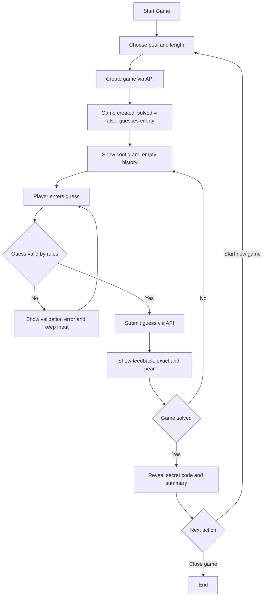

# Phase 1 – Requirements and User Stories (Draft)

## 1. Overview

Phase 1 focuses on **what** the Codebreaker Solitaire client does from the player’s point of view, independent of UI technology (console, JavaFX, Android). It captures the game lifecycle, how Unicode input is explained, and how the application reacts to common error scenarios.[page:8]

---

## 2. Game lifecycle (user-facing behavior)

A single Codebreaker Solitaire game starts when the player creates a new game, proceeds through one or more guesses, and ends when the secret code is guessed or the game is abandoned/deleted.[page:8]

### 2.1 Game creation

- The player chooses:
  - A pool of characters to build the secret code from (any Unicode characters).[page:8]
  - A code length between 1 and 20 characters.[page:8]
- The application sends a request to create a new game and receives:
  - A unique game identifier.
  - The chosen pool and length.
  - A flag `solved = false`.
  - An empty list of guesses.
- The secret code itself is not shown at this point; the player only sees the configuration and that a new game has started.[page:8]

### 2.2 Guessing loop

- The player enters guesses, one at a time, for the secret code.
- Each guess must:
  - Use only characters from the current game’s pool.
  - Be exactly the configured length.[page:8]
- For each valid guess, the application shows:
  - The guess text.
  - The number of exact matches (right character, right position).
  - The number of near matches (right character, wrong position).
  - Whether this guess is the solution.[page:8]
- The game view updates to show a running history of all guesses and their feedback until the game ends.[page:8]

### 2.3 Game completion

- When a guess exactly matches the secret code:
  - That guess is marked as the solution.
  - The game is marked as solved.
  - The secret code is revealed in the game details.[page:8]
- After completion:
  - The player can no longer submit new guesses for this game.
  - The player can review the list of guesses and their feedback.
  - The player is encouraged to start a new game if they want to continue playing.[page:8]

### 2.4 Retrieving and deleting games

- The player can resume an existing game (if it still exists) by:
  - Selecting it from a list of games, or
  - Following a previously saved link/identifier.[page:8]
- The player can request to delete a game, which:
  - Removes the game and its guesses from the service.
  - Makes the game unavailable for future retrieval.[page:8]
- Inactive games may also be removed by the service after a period of inactivity; the client must handle this gracefully.[page:8]

---

## 3. Unicode flexibility (what the UI must explain)

The service allows any Unicode characters in the pool and guesses, with a few validation rules around validity of code points and length.[page:8]

### 3.1 Explanation to the player

The user interface must clearly explain:

- The player can choose **any visible characters** for the pool:
  - Letters, digits, symbols, emoji, or combinations thereof.[page:8]
- The secret code and guesses are built from exactly those characters:
  - Every character in a guess must be taken from the pool.
  - Each guess must be exactly the configured length.[page:8]

### 3.2 Presentation of pool and length

- When configuring a new game:
  - Show a pool input and length input with short, clear labels (e.g., “Character pool” and “Code length”).[page:8]
  - Give a brief hint such as:
    - “You can use letters, numbers, symbols, or emoji. All guesses must be N characters long and use only characters from this pool.”[page:8]
- When playing:
  - Continuously display the pool and the required length near the guess input.
  - Render the pool exactly as entered, preserving Unicode characters and order.[page:8]

### 3.3 Optional presets and custom pools

- The client may offer presets (e.g., A – F, digits, emoji sets) but must also allow fully custom pools.[page:8]
- If the service ignores duplicate characters in the pool, the UI may explain this briefly (e.g., “Duplicate characters in the pool have no effect”).[page:8]

---

## 4. Error scenarios and user-facing reactions

This section describes how the application should behave for five common error scenarios. The focus is on clear, actionable messages and preserving user input where possible.[page:8]

### 4.1 Invalid game setup (400 Bad Request on create-game)

**Examples**

- Code length is outside the allowed range (e.g., < 1 or > 20).
- Pool is missing, empty, or contains invalid code points.[page:8]

**Application behavior**

- Do **not** start a game.
- Keep the user on the game-setup screen with entered values preserved.
- Show a clear message near the invalid fields, such as:
  - “Check your game settings: length must be between 1 and 20, and the pool must contain valid characters.”[page:8]
- Highlight the field (s) that caused the error and, when possible, show specific hints derived from error details.[page:8]

### 4.2 Guess length mismatch (400 Bad Request on submit-guess)

**Example**

- The player submits a guess whose character count does not match the game’s length.[page:8]

**Application behavior**

- Do **not** send guess history updates; treat the guess as invalid.
- Preserve the guess text in the input so the player can adjust it.
- Show a local validation message near the guess field:
  - “Your guess must be exactly N characters long. You entered M characters.” [page:8]

### 4.3 Invalid character in guess (client-side validation)

**Example**

- The player types a character that is not part of the chosen pool.

**Application behavior**

- Validate guesses on the client before sending them:
  - Each character must belong to the current pool.
- If the guess contains invalid characters:
  - Either prevent input (ignore the character or visually mark it as invalid), or
  - Allow input but display a prominent warning next to the guess:
    “All characters must come from the pool: [pool]”.[page:8]
- Do **not** submit invalid guesses to the service.

### 4.4 Game not found (404 Not Found)

**Examples**

- The player opens a link or tries to resume a game that:
  - Has been deleted by the user, or
  - Has been cleaned up after long inactivity.[page:8]

**Application behavior**

- Show a friendly message:
  - “This game no longer exists. It may have expired or the link is invalid.”[page:8]
- Provide a clear next step:
  - “Start a new game” action that returns the user to the new-game flow.[page:8]
- If 404 occurs when looking up a specific guess, offer:
  - “That guess is no longer available. Try refreshing the game or start a new one.”[page:8]

### 4.5 Game already solved (409 Conflict on submit-guess)

**Example**

- The player attempts to submit another guess after the game has been solved.[page:8]

**Application behavior**

- Do **not** accept the guess or modify game history.
- Show a message:
  - “This game is already completed; you cannot submit more guesses.”[page:8]
- Display the final game state:
  - Revealed secret code.
  - List of all guesses and feedback.
- Offer clear actions:
  - “Start a new game.”
  - “Close/delete this game.”[page:8]

### 4.6 Generic network or server failure (non-2xx, transient errors)

**Examples**

- Service unavailable (5xx).
- Network connectivity issues.

**Application behavior**

- Show a friendly, generalized error message:
  - “Something went wrong talking to the Codebreaker service.”[page:8]
- Optionally display a short technical summary (status code and short message) for advanced users.
- Preserve the user’s current input (game configuration or guess).
- Provide a “Retry” option, and, if appropriate, a way to return to a safe screen (e.g., game list or new-game setup).[page:8]

---

## 5. Summary of user stories (Phase 1)

**Player story – puzzle focus**

> As a puzzle-loving player,
> I want to configure a code using any characters I like and then iteratively guess it based on feedback,
> so that I can challenge my deductive reasoning and try to solve the code in as few guesses as possible.[page:8]

**Player story – Unicode creativity**

> As a creative player,
> I want to build codes out of symbols and emoji instead of only letters and numbers,
> so that I can make the game feel more personal and playful.[page:8]

**Learner story – educational focus**

> As a developer learning about web services,
> I want to see how each of my guesses changes the game state retrieved from a REST API,
> so that I can better understand how client–server interactions power interactive applications.[page:8]

**Player story – short-session play**

> As a busy player with only a few minutes at a time,
> I want to be able to start a game, make a few guesses, and resume it later without losing progress,
> so that I can enjoy the puzzle in short sessions throughout my day.[page:8]

**Player story – difficulty progression**

> As a player who likes to improve over time,
> I want to adjust the pool and length to make codes simpler or more complex,
> so that I can ramp up the difficulty as I get better and track my performance across games.[page:8]

