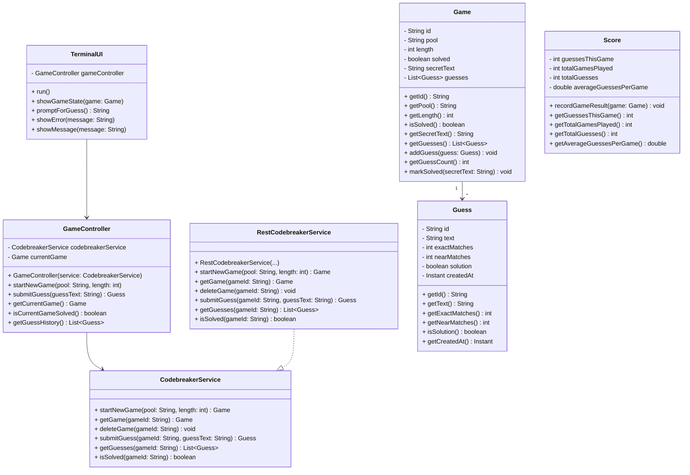

# Phase 3 – Class Design (Draft)

## 1. Overview

Phase 3 focuses on the **structure** of the system: the main classes (nouns) and their responsibilities and operations (verbs). It covers domain modeling of core classes, Java-style class signatures (fields and method names only, no bodies), and a Mermaid.js class diagram showing relationships between `TerminalUI`, `GameController`, and `RestCodebreakerService`.

***

## 2. Domain modeling (nouns and verbs)

The domain model centers around three core classes:

- **Game**
    - Represents a Codebreaker Solitaire game, including configuration (pool, length), current state (solved or not), and guess history.
    - Holds the current game state and a list of associated `Guess` objects.

- **Guess**
    - Represents a single guess submitted by the player and the feedback returned by the API.
    - Holds one guess’s data (text) and feedback (exact/near matches, whether it solved the game).

- **Score**
    - Represents performance metrics for one or more games (e.g., guesses per game, total games, aggregates).
    - Aggregates results across games to support statistics and comparison.

***

## 3. Class signatures (Game, Guess, Score)

### 3.1 Game

```text
public class Game {

    // Fields
    private String id;
    private String pool;
    private int length;
    private boolean solved;
    private String secretText;        // revealed when solved (may be null or absent while unsolved)
    private List<Guess> guesses;

    // Constructors
    public Game(String id, String pool, int length);

    // Accessors
    public String getId();
    public String getPool();
    public int getLength();
    public boolean isSolved();
    public String getSecretText();
    public List<Guess> getGuesses();

    // Domain helpers
    public void addGuess(Guess guess);
    public int getGuessCount();
    public void markSolved(String secretText);
}
```

### 3.2 Guess

```text
public class Guess {

    // Fields
    private String id;
    private String text;
    private int exactMatches;
    private int nearMatches;
    private boolean solution;
    private Instant createdAt;

    // Constructors
    public Guess(String id, String text, int exactMatches, int nearMatches, boolean solution, Instant createdAt);

    // Accessors
    public String getId();
    public String getText();
    public int getExactMatches();
    public int getNearMatches();
    public boolean isSolution();
    public Instant getCreatedAt();
}
```

### 3.3 Score

```text
public class Score {

    // Fields
    private int guessesThisGame;
    private int totalGamesPlayed;
    private int totalGuesses;
    private double averageGuessesPerGame;

    // Constructors
    public Score();

    // Recording results
    public void recordGameResult(Game game);

    // Accessors
    public int getGuessesThisGame();
    public int getTotalGamesPlayed();
    public int getTotalGuesses();
    public double getAverageGuessesPerGame();
}
```

All signatures above omit method bodies and focus on fields and method names that align with the lifecycle and state described in earlier phases.

***

## 4. Application and UI-facing classes

### 4.1 GameController

`GameController` orchestrates a single game session from the client’s perspective. It depends on a `CodebreakerService` to perform API operations and exposes methods that UIs call to start a game, submit guesses, and query state.

```text
public class GameController {

    // Dependencies
    private CodebreakerService codebreakerService;

    // State
    private Game currentGame;

    // Constructors
    public GameController(CodebreakerService codebreakerService);

    // Game lifecycle
    public void startNewGame(String pool, int length);
    public Game getCurrentGame();
    public boolean isCurrentGameSolved();

    // Guessing
    public Guess submitGuess(String guessText);
    public List<Guess> getGuessHistory();
}
```

### 4.2 RestCodebreakerService

`RestCodebreakerService` is a concrete implementation of `CodebreakerService` in the infrastructure layer. It uses HTTP and JSON internally (e.g., via libraries chosen in Phase 2), but those details are not exposed in its signature.

```text
public interface CodebreakerService {

    // Game lifecycle
    Game startNewGame(String pool, int length);
    Game getGame(String gameId);
    void deleteGame(String gameId);

    // Guessing
    Guess submitGuess(String gameId, String guessText);
    List<Guess> getGuesses(String gameId);

    // Status
    boolean isSolved(String gameId);
}

public class RestCodebreakerService implements CodebreakerService {

    // Constructors
    public RestCodebreakerService(/* HTTP and JSON dependencies */);

    // Game lifecycle
    public Game startNewGame(String pool, int length);
    public Game getGame(String gameId);
    public void deleteGame(String gameId);

    // Guessing
    public Guess submitGuess(String gameId, String guessText);
    public List<Guess> getGuesses(String gameId);

    // Status
    public boolean isSolved(String gameId);
}
```

### 4.3 TerminalUI

`TerminalUI` is a console-based UI component. It interacts with the user via standard input/output and delegates all game operations to `GameController`.

```text
public class TerminalUI {

    // Dependencies
    private GameController gameController;

    // Constructors
    public TerminalUI(GameController gameController);

    // Main loop
    public void run();

    // Helpers
    public void showGameState(Game game);
    public String promptForGuess();
    public void showError(String message);
    public void showMessage(String message);
}
```

***

## 5. Mermaid.js class diagram (bird’s-eye view)

